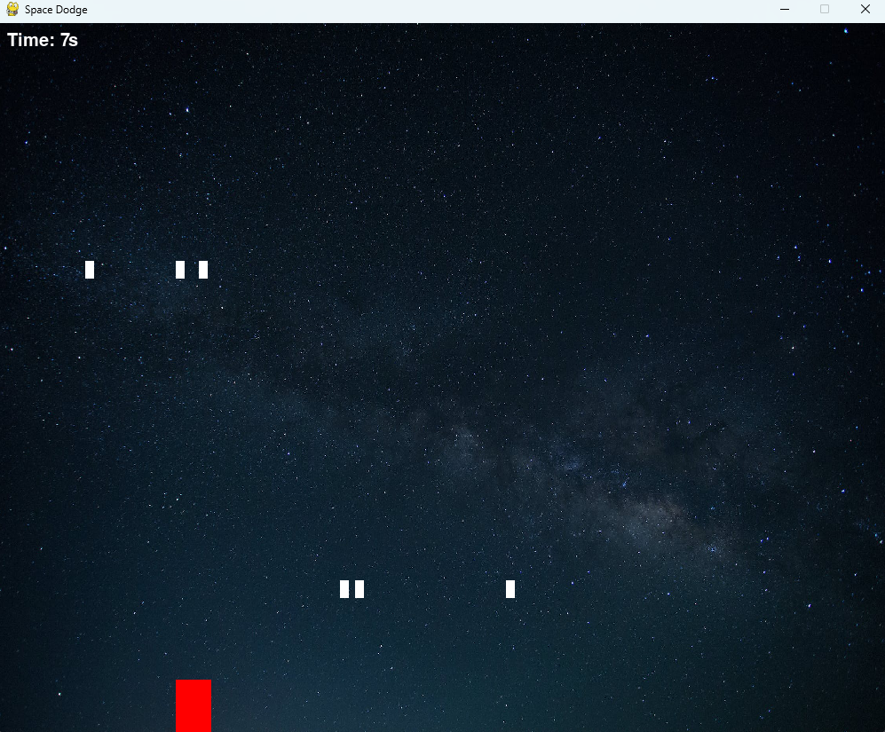

## 🚀 Space Dodge: The Infinite Particle Barrage

A thrilling, beginner-friendly Python game where you navigate a small ship through the cold vacuum of space, dodging an endless and intensifying barrage of cosmic particles. Test your reflexes, survive as long as you can, and chase that high score!

## ✨ Features

- **Infinite Gameplay:** The challenge never ends—only your reaction time does!
- **Progressive Difficulty:** Particles spawn faster and move quicker over time, keeping the game exciting.
- **Simple Controls:** Designed to be instantly playable for absolute beginners.
- **Python-Powered:** A great example project for anyone learning game development with Python (and likely Pygame).



## 💻 Getting Started

### Prerequisites

To run this game, you need Python 3.x installed and the necessary game library (e.g., Pygame).

### Clone the Repository

```bash
git clone https://github.com/SultanAhmmed/Space_Dodge.git
cd Space_Dodge
```

### Install Dependencies

(Assuming your game uses a library like Pygame or similar)

```bash
pip install pygame
```

### How to Run the Game

Execute the main game file from your terminal:

```bash
python main.py
```

## 🎮 Controls

- **Move Ship:** Use the Arrow Keys (Left, Right).

## 🤝 Contributing

Feel free to fork the repository, submit pull requests, or open issues if you find any bugs!

Made with ❤️ by Sultan Ahmmed.
